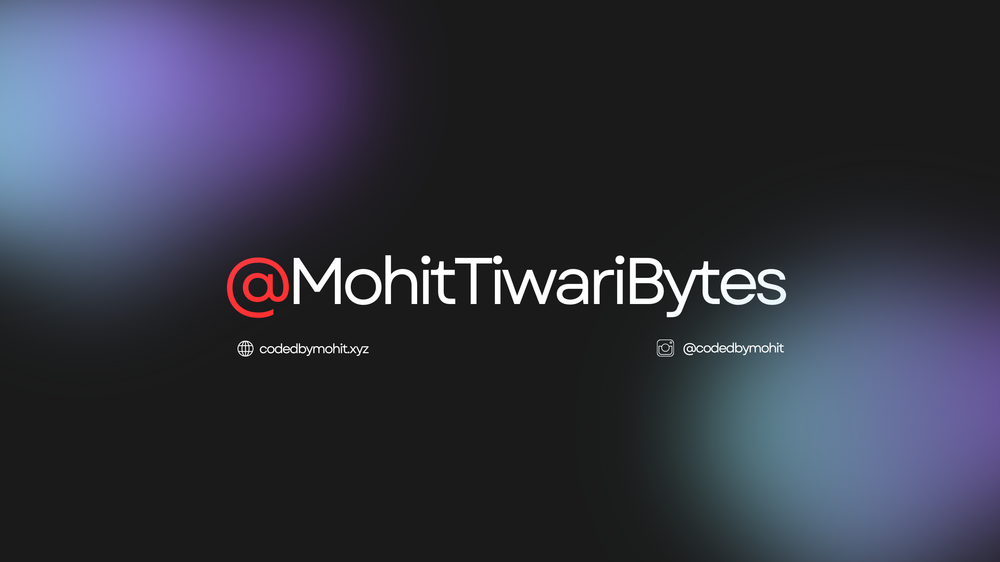

  

# Hello World!, I'm Mohit, A Front-end Developer from India! 👋🏼:
🛜 Currently building [@CraftedByLunar](https://github.com/CraftedByLunar) 👨🏼‍🎓 Studying in 8th grade at Shri Krishna Inter College 👨🏼‍💻 Creative Web Developer @ SHVDOW

---

  
  

  

---

# 💻 Tech Stack:
                

<picture>
  <source media="(prefers-color-scheme: dark)" srcset="https://raw.githubusercontent.com/tobiasmeyhoefer/tobiasmeyhoefer/output/github-snake-dark.svg" />
  <source media="(prefers-color-scheme: light)" srcset="https://raw.githubusercontent.com/tobiasmeyhoefer/tobiasmeyhoefer/output/github-snake.svg" />
  
</picture>
